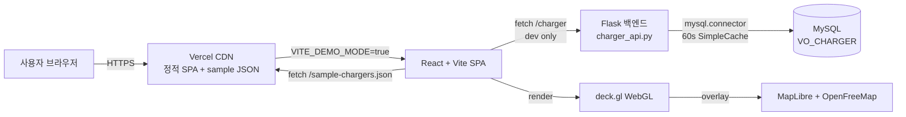

# EV-STATION

한국 전기차 충전소를 시각화하는 WebGL 기반 지오스페이셜 대시보드.

[](https://github.com/wkddns40/ev-station/actions/workflows/ci.yml)
[](frontend/vitest.config.ts)
[](https://ev-station-ten.vercel.app/)
[](LICENSE)
[](frontend/tsconfig.json)
[](frontend/vite.config.js)

> 🇺🇸 English README: [`README.md`](README.md)

## 목차

- [라이브 데모](#라이브-데모)
- [기능](#기능)
- [엔지니어링 하이라이트](#엔지니어링-하이라이트)
- [기술 스택](#기술-스택)
- [아키텍처](#아키텍처)
- [로컬 개발](#로컬-개발)
- [스크립트 목록](#스크립트-목록)
- [프로젝트 구조](#프로젝트-구조)
- [마이그레이션 이야기](#마이그레이션-이야기)
- [리팩토링 이전 상태](#리팩토링-이전-상태)
- [라이선스](#라이선스)

## 라이브 데모

**👉 [ev-station-ten.vercel.app](https://ev-station-ten.vercel.app/)** — 400개 피처의 정적 스냅샷(`frontend/public/sample-chargers.json`)으로 동작하는 데모 모드. 백엔드 불필요.


## 기능

| | |
|---|---|
|  |  |
| 지역 줌 — 서울 / 경기·인천 / 제주 | 원터치 뷰포트 프리셋 |
|  |  |
| 단계별 필터(지역 → 제조사 → 계량기 → 효율) | 통계 요약(평균/최소/최대) + CSV 다운로드 |

## 엔지니어링 하이라이트

- **풀 strict TypeScript** — `noUncheckedIndexedAccess` + `exactOptionalPropertyTypes` 전 소스 적용. 앱 코드에 `any` 0건. deck.gl 미타입 모듈은 `vite-env.d.ts` 한 곳에 격리.
- **메모이즈된 레이어 팩토리** — deck.gl `ColumnLayer` / `IconLayer` / `PathLayer` 재생성이 컴포넌트 전체 상태가 아닌 실제 데이터 dep(`validData`, `lastDataPoint`, `paths`)에 키잉됨. 렌더 결과에 영향 없는 필터 토글은 레이어 churn 0.
- **깨지기 어려운 상태** — 필터용 `useReducer` + Context, action union에 `_exhaustive: never` 가드. 레거시가 사용하던 필터 섀도우 상태 동기화용 sync `useEffect` 3개 제거. 업데이트는 원자적으로 반영됨.
- **기본 정적 데모** — `VITE_DEMO_MODE=true`로 데이터 소스를 결정론적 400 피처 스냅샷(`backend/scripts/generate_mock.py`, seed 42)으로 전환. 라이브 데모는 백엔드 없이 작동. 프로덕션 백엔드 코드는 `backend/charger_api.py`에 그대로 보존.
- **CI가 머지 게이트** — 모든 PR이 frontend lint + typecheck + Vitest 커버리지(`src/lib/**` + `src/state/**` ≥70%) + Vite build, backend ruff + pytest 커버리지(≥70%)를 실행. Vercel은 PR별 프리뷰 배포.

## 기술 스택

| 레이어 | 도구 |
|---|---|
| 언어 | TypeScript 6, 풀 strict |
| 빌드 | Vite 5 |
| UI | React 18 |
| 지도 | MapLibre GL + react-map-gl v8 (`react-map-gl/maplibre` 서브경로) |
| 타일 | [OpenFreeMap Liberty](https://openfreemap.org) — API 키 불필요 |
| 오버레이 | deck.gl 8 (ColumnLayer + IconLayer + PathLayer) |
| 상태 | `useReducer` + Context(필터), TanStack Query 5(데이터) |
| 테스트 | Vitest 4 + `@testing-library/react` 16(프론트), pytest 8 + pytest-flask(백엔드) |
| CI | GitHub Actions(프론트 + 백엔드) |
| 호스팅 | Vercel(프론트), Flask 백엔드는 dev only |
| 린트 | ESLint 10 flat config, ruff 0.15 |

## 아키텍처



전체 시스템 + 데이터 흐름: [`docs/ARCHITECTURE.md`](docs/ARCHITECTURE.md).

## 로컬 개발

```bash
# 프론트엔드 (데모 모드 — 백엔드 불필요)
cd frontend
npm ci --legacy-peer-deps
VITE_DEMO_MODE=true npm run dev          # → http://localhost:3000

# 프론트엔드 (개발 모드 — 실제 백엔드)
npm run dev

# 백엔드 (dev only — Flask)
cd backend
pip install -r requirements.txt
python mock_server.py                     # → http://localhost:5000
```

정적 데모 스냅샷 재생성:

```bash
python backend/scripts/generate_mock.py
# frontend/public/sample-chargers.json 생성 (400 피처, seed 42)
```

## 스크립트 목록

| 명령 | 효과 |
|---|---|
| `cd frontend && npm run dev` | Vite 개발 서버, 3000 포트, 실제 백엔드 |
| `cd frontend && VITE_DEMO_MODE=true npm run dev` | 데모 모드 — 정적 JSON, 백엔드 없음 |
| `cd frontend && npm run build` | 프로덕션 빌드 → `frontend/dist/` |
| `cd frontend && npm run typecheck` | `tsc --noEmit` (풀 strict) |
| `cd frontend && npm run lint` | ESLint flat config |
| `cd frontend && npm test` | Vitest 실행 (50 tests, ~5s) |
| `cd frontend && npm run test:coverage` | Vitest + v8 커버리지 70% 임계값 |
| `cd backend && pytest` | pytest 커버리지 (12 tests, ≥70% 필수) |
| `cd backend && ruff check .` | 백엔드 lint |
| `python backend/scripts/generate_mock.py` | `sample-chargers.json` 재생성 |

## 프로젝트 구조

```
ev-station/
├── frontend/
│   ├── src/
│   │   ├── lib/           # 순수 유틸 (csv, geo, env) — 테스트 대상
│   │   ├── state/         # filtersReducer + Context — 테스트 대상
│   │   ├── hooks/         # useChargerData, useMapViewport, useFilteredChargers, useChargerLayers
│   │   ├── types/         # charger + filters 도메인 타입
│   │   ├── constants/     # viewport / 지도 스타일 URL
│   │   ├── DemoBanner.tsx
│   │   ├── Evstation.tsx  # 지도 셸 (즉시 로드)
│   │   ├── LeftPane.tsx / RightPane.tsx / SearchFilterPane.tsx (lazy)
│   │   └── main.tsx
│   ├── public/
│   │   ├── sample-chargers.json    # 400 피처 데모 스냅샷
│   │   └── car.png                 # deck.gl IconLayer 아틀라스
│   ├── tests/setup.ts              # Vitest + RTL 설정
│   ├── eslint.config.js · vite.config.js · vitest.config.ts · vercel.json
│   └── package.json
├── backend/
│   ├── charger_api.py              # 프로덕션 Flask (Cache(60s) 데코레이터)
│   ├── mock_server.py              # dev only fixture 서버
│   ├── scripts/generate_mock.py    # 결정론적 데모 데이터 생성기 (seed 42)
│   ├── tests/                      # pytest (geojson + chargers)
│   └── pyproject.toml              # ruff + pytest 커버리지 게이트
├── docs/
│   ├── ARCHITECTURE.md             # 시스템 + 데이터 흐름 + 상태 모델
│   ├── MIGRATION.md                # before/after + 결정 내러티브 + 교훈
│   ├── BEFORE_AFTER.md             # 번들 메트릭
│   ├── decisions/                  # ADR (001–004)
│   ├── lighthouse/                 # T3.7 리포트 + gap 분석
│   └── screenshots/                # 1280×720 기능 캡처
├── .github/workflows/ci.yml        # lint + typecheck + test + build
├── LICENSE                         # MIT
└── REFACTOR_PLAN.md                # 페이즈 플레이북 (원자적 태스크 + 잠금 결정)
```

## 마이그레이션 이야기

2023년 포트폴리오 프로젝트의 전면 리팩토링. 리팩토링 이전 소스는 `legacy` 브랜치 + `v0-legacy` 태그에 보존. [`docs/MIGRATION.md`](docs/MIGRATION.md).

ADR(Architecture Decision Records):

- [ADR 001 — CRA 대신 Vite](docs/decisions/001-vite-over-cra.md)
- [ADR 002 — Mapbox 대신 MapLibre](docs/decisions/002-maplibre-over-mapbox.md)
- [ADR 003 — Redux 대신 useReducer + Context](docs/decisions/003-usereducer-over-redux.md)
- [ADR 004 — 데이터 페칭은 TanStack Query](docs/decisions/004-tanstack-query.md)

## 리팩토링 이전 상태

리팩토링 이전 소스는 `legacy` 브랜치와 서명된 `v0-legacy` 태그에 보존.

```
git fetch origin
git checkout legacy
```

## 라이선스

MIT — [`LICENSE`](LICENSE) 참조.
