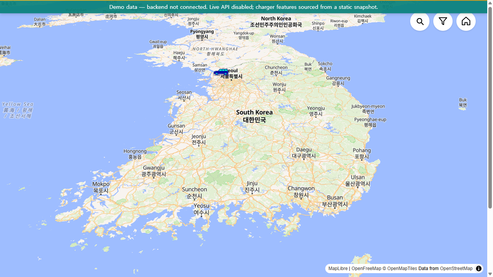
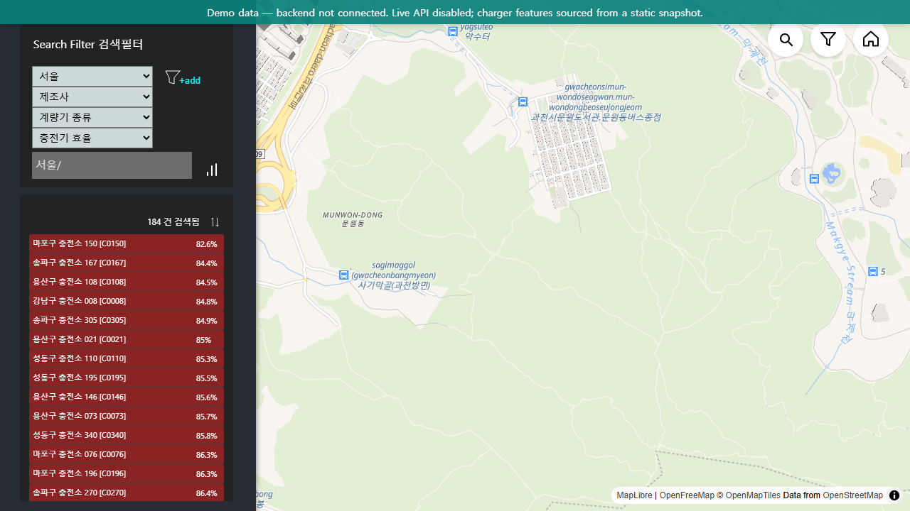
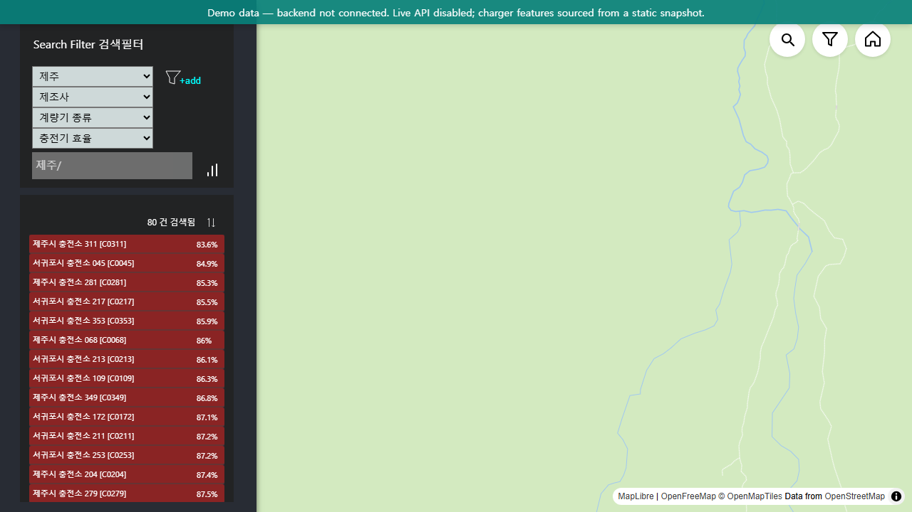
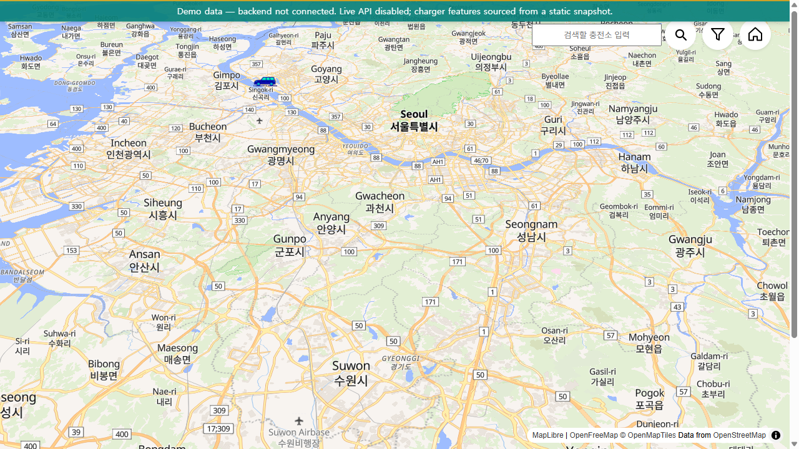
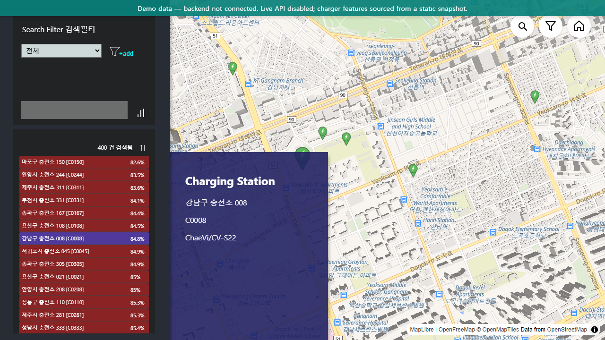
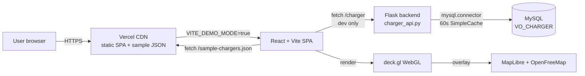

# EV-STATION

Real-time EV charging station dashboard for Korea with WebGL-accelerated geospatial visualization.

[](https://github.com/wkddns40/ev-station/actions/workflows/ci.yml)
[](frontend/vitest.config.ts)
[](https://ev-station-ten.vercel.app/)
[](LICENSE)
[](frontend/tsconfig.json)
[](frontend/vite.config.js)

> 🇰🇷 한국어 README: [`README.ko.md`](README.ko.md)

## Contents

- [Live demo](#live-demo)
- [Features](#features)
- [Engineering highlights](#engineering-highlights)
- [Stack](#stack)
- [Architecture](#architecture)
- [Local development](#local-development)
- [Available scripts](#available-scripts)
- [Project structure](#project-structure)
- [Migration story](#migration-story)
- [Pre-refactor state](#pre-refactor-state)
- [License](#license)

## Live demo

**👉 [ev-station-ten.vercel.app](https://ev-station-ten.vercel.app/)** — runs in demo mode against a 400-feature static snapshot (`frontend/public/sample-chargers.json`). No backend required.



## Features

| | |
|---|---|
|  |  |
| Region zoom — Seoul / 경기·인천 / Jeju | One-tap viewport presets |
|  |  |
| Cascading filters (region → manufacturer → 계량기 → efficiency) | Stats summary (avg / min / max) + CSV download |

## Engineering highlights

- **Full strict TypeScript** — `noUncheckedIndexedAccess` + `exactOptionalPropertyTypes` across 100% of source. Zero `any` in app code; deck.gl's untyped modules are isolated behind a single `vite-env.d.ts` shim.
- **Memoized layer factory** — deck.gl `ColumnLayer` / `IconLayer` / `PathLayer` recreation is keyed on the actual data deps (`validData`, `lastDataPoint`, `paths`), not the whole component state. Filter toggles that don't change the rendered set produce zero layer churn.
- **State that's hard to break** — `useReducer` + Context for filters with an `_exhaustive: never` guard on the action union. The 3 sync `useEffect`s the legacy codebase used to keep filter shadow-state in sync are gone; updates land atomically.
- **Static demo by default** — `VITE_DEMO_MODE=true` swaps the data source to a deterministic 400-feature snapshot (`backend/scripts/generate_mock.py`, seed 42). Live demo runs with no backend at all; production backend code lives untouched in `backend/charger_api.py`.
- **CI is the merge gate** — every PR runs lint + typecheck + Vitest with coverage (≥70% on `src/lib/**` + `src/state/**`) + Vite build for the frontend, and ruff + pytest with coverage (≥70%) for the backend. Vercel deploys a preview per PR.

## Stack

| Layer | Tooling |
|---|---|
| Language | TypeScript 6, full strict |
| Build | Vite 5 |
| UI | React 18 |
| Map | MapLibre GL + react-map-gl v8 (`react-map-gl/maplibre` subpath) |
| Map tiles | [OpenFreeMap Liberty](https://openfreemap.org) — no API key |
| Overlay | deck.gl 8 (ColumnLayer + IconLayer + PathLayer) |
| State | `useReducer` + Context (filters), TanStack Query 5 (data) |
| Tests | Vitest 4 + `@testing-library/react` 16 (frontend), pytest 8 + pytest-flask (backend) |
| CI | GitHub Actions (frontend + backend) |
| Hosting | Vercel (frontend), Flask backend dev-only |
| Lint | ESLint 10 flat config, ruff 0.15 |

## Architecture



Full system + data-flow diagrams: [`docs/ARCHITECTURE.md`](docs/ARCHITECTURE.md).

## Local development

```bash
# Frontend (demo mode — no backend needed)
cd frontend
npm ci --legacy-peer-deps
VITE_DEMO_MODE=true npm run dev          # → http://localhost:3000

# Frontend (dev mode hits the real backend)
npm run dev

# Backend (dev only — Flask)
cd backend
pip install -r requirements.txt
python mock_server.py                     # → http://localhost:5000
```

Regenerate the static demo snapshot:

```bash
python backend/scripts/generate_mock.py
# writes frontend/public/sample-chargers.json (400 features, seed 42)
```

## Available scripts

| Command | Effect |
|---|---|
| `cd frontend && npm run dev` | Vite dev server, port 3000, hits real backend |
| `cd frontend && VITE_DEMO_MODE=true npm run dev` | Demo mode — static JSON, no backend |
| `cd frontend && npm run build` | Production build → `frontend/dist/` |
| `cd frontend && npm run typecheck` | `tsc --noEmit` (full strict) |
| `cd frontend && npm run lint` | ESLint flat config |
| `cd frontend && npm test` | Vitest run (50 tests, ~5s) |
| `cd frontend && npm run test:coverage` | Vitest + v8 coverage with 70% threshold |
| `cd backend && pytest` | pytest with coverage (12 tests, ≥70% required) |
| `cd backend && ruff check .` | Backend lint |
| `python backend/scripts/generate_mock.py` | Regenerate `sample-chargers.json` |

## Project structure

```
ev-station/
├── frontend/
│   ├── src/
│   │   ├── lib/           # pure utilities (csv, geo, env) — tested
│   │   ├── state/         # filtersReducer + Context — tested
│   │   ├── hooks/         # useChargerData, useMapViewport, useFilteredChargers, useChargerLayers
│   │   ├── types/         # charger + filters domain types
│   │   ├── constants/     # viewport / map style URL
│   │   ├── DemoBanner.tsx
│   │   ├── Evstation.tsx  # map shell (eager)
│   │   ├── LeftPane.tsx / RightPane.tsx / SearchFilterPane.tsx (lazy)
│   │   └── main.tsx
│   ├── public/
│   │   ├── sample-chargers.json    # 400-feature demo snapshot
│   │   └── car.png                 # deck.gl IconLayer atlas
│   ├── tests/setup.ts              # Vitest + RTL setup
│   ├── eslint.config.js · vite.config.js · vitest.config.ts · vercel.json
│   └── package.json
├── backend/
│   ├── charger_api.py              # production Flask app (Cache(60s) decorator)
│   ├── mock_server.py              # dev-only fixture server
│   ├── scripts/generate_mock.py    # deterministic demo data generator (seed 42)
│   ├── tests/                      # pytest (geojson + chargers)
│   └── pyproject.toml              # ruff + pytest coverage gate
├── docs/
│   ├── ARCHITECTURE.md             # system + data-flow + state model
│   ├── MIGRATION.md                # before/after + decision narrative + lessons
│   ├── BEFORE_AFTER.md             # bundle metrics
│   ├── decisions/                  # ADRs (001–004)
│   ├── lighthouse/                 # T3.7 reports + gap analysis
│   └── screenshots/                # 1280×720 feature captures
├── .github/workflows/ci.yml        # lint + typecheck + test + build
├── LICENSE                         # MIT
└── REFACTOR_PLAN.md                # phase playbook (atomic tasks + locked decisions)
```

## Migration story

This is a complete refactor of a 2023 portfolio project. The pre-refactor source is on the `legacy` branch and tagged `v0-legacy`. Why the refactor, what changed, what was rejected, and what we'd do differently: [`docs/MIGRATION.md`](docs/MIGRATION.md).

Architecture Decision Records:

- [ADR 001 — Vite over CRA](docs/decisions/001-vite-over-cra.md)
- [ADR 002 — MapLibre over Mapbox](docs/decisions/002-maplibre-over-mapbox.md)
- [ADR 003 — useReducer + Context over Redux](docs/decisions/003-usereducer-over-redux.md)
- [ADR 004 — TanStack Query for data fetching](docs/decisions/004-tanstack-query.md)

## Pre-refactor state

The pre-refactor source is preserved on the `legacy` branch and the signed `v0-legacy` tag.

```
git fetch origin
git checkout legacy
```

## License

MIT — see [`LICENSE`](LICENSE).
