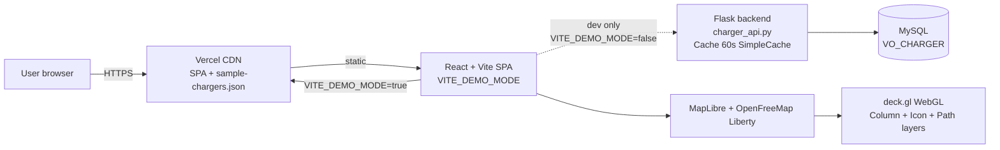
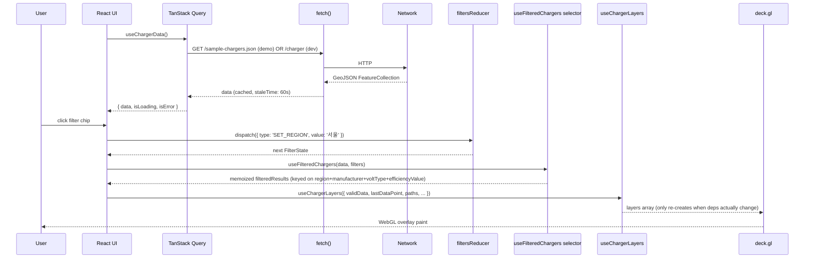

# Architecture

This document covers system topology, data flow, state model, and caching. For the *why* behind major choices, see the [ADRs](decisions/).

## System diagram



**Production today:** `user → Vercel CDN → SPA → /sample-chargers.json` (no backend in the loop). The Flask layer + MySQL are dev-only and intentionally never deployed publicly (D5).

## Data flow



## State model

Filter state is a single `useReducer` keyed by an exhaustive `FilterAction` union. The reducer lives in [`frontend/src/state/filtersReducer.ts`](../frontend/src/state/filtersReducer.ts); the context wrapper in [`frontend/src/state/FiltersContext.tsx`](../frontend/src/state/FiltersContext.tsx).

```typescript
export type FilterState = {
  region: string;         // '' | '서울' | '경기/인천' | '제주'
  manufacturer: string;   // '' | 'BlueOne' | 'ChargePoint' | …
  voltType: string;       // '' | '급속' | '완속'
  efficiencyValue: string;
  sortOrder: 'asc' | 'desc';
  filterStep: number;
};

export type FilterAction =
  | { type: 'SET_REGION'; value: string }
  | { type: 'SET_MANUFACTURER'; value: string }
  | { type: 'SET_VOLT_TYPE'; value: string }
  | { type: 'SET_EFFICIENCY_VALUE'; value: string }
  | { type: 'SET_FILTER_STEP'; value: number }
  | { type: 'TOGGLE_SORT_ORDER' }
  | { type: 'RESET' };
```

The reducer ends in `_exhaustive: never` so an unhandled action is a compile error.

### Memoization barriers

| Layer | Hook | Re-runs when |
|---|---|---|
| Filter predicate | `useFilteredChargers` | `data`, `filters.region`, `filters.manufacturer`, `filters.voltType`, `filters.efficiencyValue` (NOT `sortOrder` / `filterStep`) |
| Geometry derivations | `useMemo(getValidData / getLatestDataPoint / buildPaths)` | `data` identity |
| deck.gl layers | `useChargerLayers` | `validData`, `lastDataPoint`, `paths`, `showAllData`, `elevationFactor` |
| Viewport | `useMapViewport` | `mapViewState` |

The barriers are independent: a `TOGGLE_SORT_ORDER` dispatch doesn't invalidate the filter memo (so layers don't rebuild), but does cause the result list to re-render in the side pane.

## Caching strategy

| Cache | Where | TTL | Invalidation |
|---|---|---|---|
| Frontend query cache | TanStack Query (`QueryClient` in `main.tsx`) | `staleTime: 60_000` | Manual via `queryClient.invalidateQueries(['chargers'])`; `refetchOnWindowFocus: false` |
| Static demo snapshot | `frontend/public/sample-chargers.json` | committed file; Vercel edge headers | New deploy regenerates / overrides |
| Backend route cache | Flask-Caching `SimpleCache` on `/charger` | 60s | Process restart (development only — backend isn't deployed) |
| MapLibre tile cache | Browser HTTP cache | OpenFreeMap CDN-driven | Browser TTL |

## Component layout

```
main.tsx
└── <QueryClientProvider>
    └── <FiltersProvider>
        ├── <DemoBanner />           # gated by VITE_DEMO_MODE
        └── <Evstation />            # map shell, eager
            ├── <DeckGL>
            │   └── <Map>            # react-map-gl/maplibre
            │       ├── <Tooltip />  # eager
            │       └── <Suspense>   # lazy chunks below
            │           ├── <RightPane />
            │           ├── <LeftPane />
            │           └── <SearchFilterPane />
            └── <ButtonGroup />      # eager
```

`LeftPane` / `RightPane` / `SearchFilterPane` are split with `React.lazy` so they don't ship in the initial chunk (about 35 KB raw). The map shell renders eagerly because the map *is* the LCP element — lazy-loading the map regresses LCP by ~1.5s on mobile Lighthouse (verified, see `docs/lighthouse/README.md`).

## Vendor chunk split (`vite.config.js`)

`manualChunks` groups by source path so cache hit ratio survives app-code redeploys:

| Chunk | Source | Raw / Gzip |
|---|---|---|
| `react-*.js` | `react`, `react-dom` | 142 KB / 46 KB |
| `deckgl-*.js` | `@deck.gl/*`, `deck.gl` | 453 KB / 134 KB |
| `maplibre-*.js` | `maplibre-gl`, `react-map-gl` | 1071 KB / 291 KB |
| `query-*.js` | `@tanstack/react-query` | 39 KB / 12 KB |
| `react-sliding-pane-*.js` | `react-sliding-pane` | 29 KB / 9 KB |
| `Evstation-*.js` | app code | ~12 KB / ~5 KB |

## Deployment topology

- **Production:** master branch → Vercel production deploy → `ev-station-ten.vercel.app`. Build runs from `frontend/` root (`vercel.json` pins `installCommand: npm ci --legacy-peer-deps`).
- **Preview:** every PR triggers a Vercel preview deploy. Status posted to the PR via the `Vercel` check.
- **Backend:** intentionally not deployed (D5). `mock_server.py` and `charger_api.py` are dev-only.
- **CI:** GitHub Actions runs on `push: [master]` and `pull_request`. Frontend job: lint → typecheck → Vitest (coverage 70% gate) → Vite build. Backend job: ruff → pytest (coverage 70% gate).

## Security boundaries

- **No secrets in repo content.** Backend reads `DB_HOST` / `DB_USER` / `DB_PASSWORD` / `DB_NAME` from env; `backend/.env.example` documents the shape only.
- **No backend in production.** Static demo eliminates the API attack surface for the live deploy.
- **No API keys in tile URLs.** OpenFreeMap Liberty is keyless (D2 / [ADR 002](decisions/002-maplibre-over-mapbox.md)).
- **Commit identity:** all refactor commits authored as `wkddns40 <wkddns40@gmail.com>` (D9). No `Co-Authored-By` trailers permitted (sole-ownership history; see project AGENTS.md + CLAUDE.md rules).
